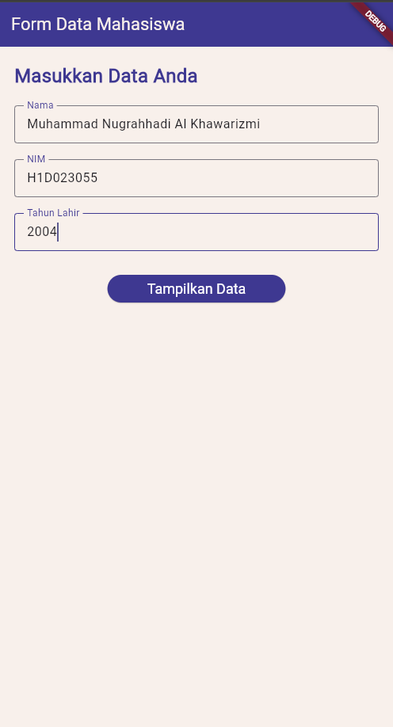
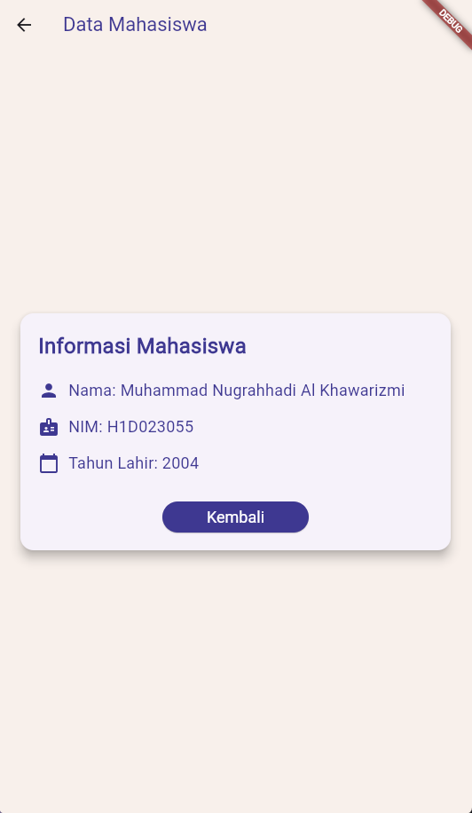

# h1d023055_tugas6

| Label          | Value                             |
| -------------- | --------------------------------- |
| Nama           | Muhammad Nugrahhadi Al Khawarizmi |
| NIM            | H1D023055                         |
| Shift Awal     | G                                 |
| Shift Sekarang | A                                 |

## Proses Passing Data dari Form ke Tampilan

### Proses Passing Data

Proses passing data dari form ke tampilan dilakukan menggunakan navigasi Flutter dengan `Navigator.push` dan passing data melalui constructor parameter.

#### Langkah-langkah:

1. **Input Data di FormData**:

   - Pengguna mengisi form dengan nama, NIM, dan tahun lahir.
   - Data disimpan dalam `TextEditingController` untuk setiap field.

2. **Validasi dan Navigasi**:

   - Ketika tombol "Tampilkan Data" ditekan, form divalidasi menggunakan `_formKey.currentState!.validate()`.
   - Jika valid, `Navigator.push` dipanggil untuk berpindah ke halaman `TampilData`.
   - Data dikirim sebagai parameter constructor: `TampilData(nama: _namaController.text, nim: _nimController.text, tahunLahir: _tahunLahirController.text)`.

3. **Penerimaan Data di TampilData**:

   - `TampilData` adalah `StatelessWidget` yang menerima data melalui constructor parameters: `final String nama;`, `final String nim;`, `final String tahunLahir;`.
   - Data ditampilkan dalam UI menggunakan `Text` widgets.

4. **Kembali ke Form**:
   - Tombol "Kembali" menggunakan `Navigator.pop(context)` untuk kembali ke halaman sebelumnya.

## Screenshots Hasil

### Form Input Data

### Hasil Tampilan Data

